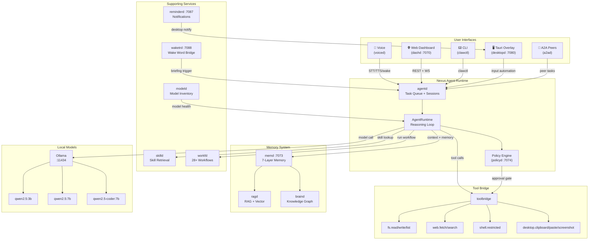
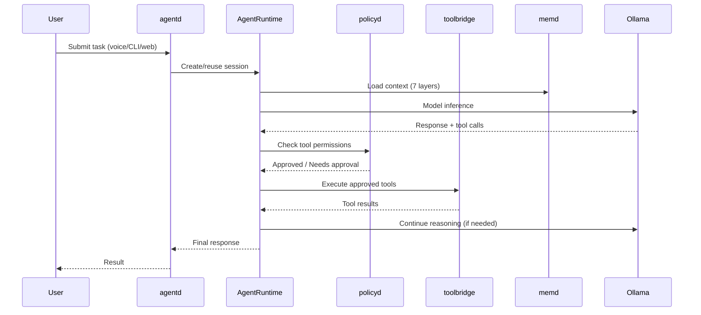

# ClawOS Architecture Diagram

> Diagram-as-code version of the architecture. Renders natively on GitHub.
> For the full architecture narrative, see [ARCHITECTURE_CURRENT.md](ARCHITECTURE_CURRENT.md).

## System Overview

## Request Flow

## Daemon Ports

| Daemon | Port | Role |
|:-------|:-----|:-----|
| `dashd` | 7070 | Dashboard API + WebSocket events |
| `memd` | 7073 | 7-layer memory service |
| `policyd` | 7074 | Permission checks + audit |
| `desktopd` | 7080 | Input automation (clipboard, paste, screenshot) |
| `reminderd` | 7087 | Desktop notifications |
| `waketrd` | 7088 | Wake word → briefing bridge |
| `ollama` | 11434 | Local model inference |

> Daemons without a listed port communicate via the in-process event bus, not over HTTP.